  

  
  
  

---

# 👨‍💻 About Me

전자공학을 기반으로 **Embedded Systems, Robotics, Computer Vision, Artificial Intelligence**를 공부하고 있습니다.

단순히 하나의 모델이나 기능을 구현하는 것보다 센서와 MCU에서 시작해 제어, AI 모델, 소프트웨어까지 연결하여 **실제 환경에서 동작하는 하나의 시스템을 만드는 과정**에 관심이 있습니다.

프로젝트를 통해 STM32·ESP32 기반 임베디드 제어, 로봇 주행 및 추종 알고리즘, Computer Vision, Deep Learning, Web Service 등을 경험했습니다.

현재는 **Hardware와 AI를 연결하는 Intelligent System**과 실제 서비스 환경에서 활용할 수 있는 AI 기술에 관심을 가지고 있습니다.

 

## ✦ Highlights

| | |
|---|---|
| 🏆 **5 Awards** | Embedded · Robotics · AI 프로젝트 및 경진대회 |
| 📄 **First-author Research** | Hybrid Recommendation System · IEEE Access 심사 진행 |
| 🤖 **System Development** | Embedded Hardware → Control → AI → Software |
| 🎓 **Electronic Engineering** | Artificial Intelligence 융합 전공 |

---

 

# 🚀 Featured Projects

### 🏥 Autonomous Smart IV Pole

> **UWB · Computer Vision · Sensor Fusion 기반 환자 추종 의료 보조 시스템**

  

환자가 직접 링거폴대를 밀어야 하는 불편과 보행 중 위험을 줄이기 위해, 환자를 인식하고 일정 거리를 유지하며 따라가는 **Mapless Autonomous Following System**을 개발했습니다.

**My Role — Software Engineer**
- Curvature 기반 환자 추종 알고리즘 설계
- YOLO 기반 환자 자동 인식
- STM32 기반 모터 및 이동 제어
- UWB · Camera · Ultrasonic Sensor Fusion
- 시스템 통합, QC 및 실제 주행 테스트

**Tech** · `STM32` `ESP32` `C/C++` `Python` `YOLO` `UWB` `Computer Vision` `Sensor Fusion`

**Result** · 🏅 한국공학대학교 전자공학부 **학부장상**

[Repository →](https://github.com/Wake-Up-It-s-a-Hospital)

---

### 🧠 Hybrid Retrieve–then–Rank Recommendation System

> **Matrix Factorization과 Graph Neural Network를 결합한 대규모 추천 시스템**

대규모 추천 환경에서 모든 후보에 복잡한 모델을 적용하는 계산 비용을 줄이기 위해 **Matrix Factorization → Candidate Retrieval → Graph Neural Network Ranking** 구조의 하이브리드 추천 프레임워크를 연구했습니다.

**My Role — First Author**
- 추천 시스템 전체 구조 설계
- Matrix Factorization 기반 Candidate Retrieval
- Graph Neural Network 기반 Ranking
- 대규모 E-commerce 데이터 전처리 및 실험
- 추천 성능 및 계산 효율 비교 분석

**Tech** · `Python` `PyTorch` `GNN` `Matrix Factorization` `Recommendation System`

**Research** · *A Hybrid Retrieve–then–Rank Framework Integrating Matrix Factorization and Graph Neural Networks*  
**Journal** · IEEE Access · **Status** · Revision 대기

---

### 🤖 Refactory

> **LLM 기반 GitHub Pull Request 자동 코드 리뷰 플랫폼**

  

GitHub Pull Request의 코드 변경 사항을 LLM으로 분석하여 자동 리뷰를 제공하는 플랫폼을 개발했습니다.

**My Role — Frontend Developer · UI/UX Designer**
- 서비스 UI/UX 설계
- Frontend 개발
- 코드 리뷰 결과 인터페이스 구현
- 사용자 Workflow 설계 및 서비스 통합

**Tech** · `React` `JavaScript` `LLM` `GitHub` `UI/UX`

**Result** · 🥉 **Techeer Winter BootCamp 공동 3위**

[Repository →](https://github.com/2024-Winter-BootCamp-TeamD)

---

### 🌱 Smart Farm

> **YOLOv8 기반 작물 성장 판단 및 자동 생육 관리 시스템**

수경재배 환경에서 작물의 상태를 자동으로 분석하고 생육 환경을 관리하기 위해 Computer Vision과 Embedded System을 결합한 스마트팜 시스템을 개발했습니다.

**Tech** · `YOLOv8` `Python` `Computer Vision` `Embedded System`

**Result** · 🥇 제8회 임베디드 시스템 경진대회 **최우수상**

---

## Research

### A Hybrid Retrieve–then–Rank Framework Integrating Matrix Factorization and Graph Neural Networks

대규모 전자상거래 추천 환경에서 계산 효율성과 추천 성능을 함께 고려하기 위해 **Matrix Factorization 기반 Candidate Retrieval과 Graph Neural Network 기반 Ranking을 결합한 Retrieve–then–Rank 구조**를 연구했습니다.

| Item | Information |
|---|---|
| Role | **First Author** |
| Journal | IEEE Access |
| Publisher | IEEE |
| Status | Revision 대기 |
| Area | Recommender Systems · Graph Neural Networks |

---

## Awards

| Award | Project | Competition / Organization | Year |
|---|---|---|---:|
| 🏅 **학부장상** | Autonomous Smart IV Pole | 한국공학대학교 전자공학부 | 2025 |
| 🥇 **최우수상** | Smart Farm | 제8회 임베디드 시스템 경진대회 | 2024 |
| 🥈 **은상** | Waveshare JetRacer | 제2회 미래형 자동차 자율주행 경진대회 | 2024 |
| 🥉 **공동 3위** | Refactory | Techeer Winter BootCamp | 2024 |
| 🎖️ **장려상** | EV3 Robot Programming | 제5회 총장배 로봇 프로그래밍 경진대회 | 2024 |

---

## Technical Skills

  

**Core** · `Python` `C/C++` `PyTorch` `STM32` `ESP32`  
**AI** · `Computer Vision` `Deep Learning` `Graph Neural Network` `Recommendation System`  
**Embedded / Robotics** · `Motor Control` `Sensor Fusion` `Autonomous Following` `Verilog`  
**Software** · `React` `Vue` `Django` `MySQL` `AWS`

---

## Engineering Background

| Area | Experience |
|---|---|
| Digital Logic | Verilog · Quartus |
| Circuit Design | PSpice · Electronic Circuit Design |
| Microcontroller | STM32 · ESP32 |
| Control | Motor Control · Curvature-based Tracking |
| Robotics | Autonomous Driving · Patient Following |
| Computer Vision | YOLO · Object Recognition |
| Artificial Intelligence | Deep Learning · Recommendation System · GNN |
| Software Engineering | Frontend · Backend · Cloud |

---

## Certifications

| Certification | Organization | Acquired |
|---|---|---:|
| 데이터분석 준전문가 (ADsP) | 한국데이터산업진흥원 | 2026.06 |

---

## Profile Snapshot

  

  

---

## Contact

  

