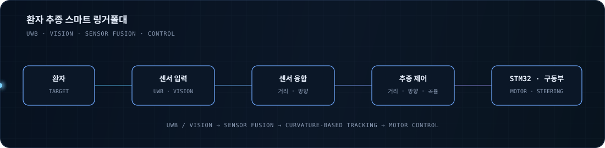
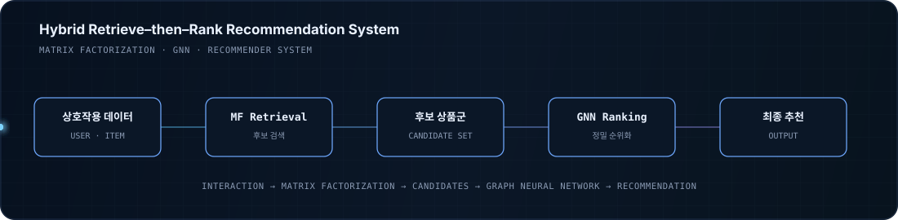
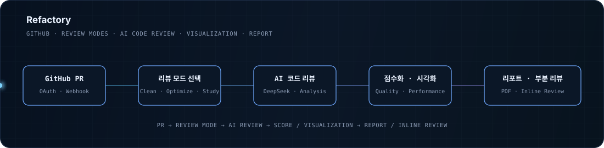
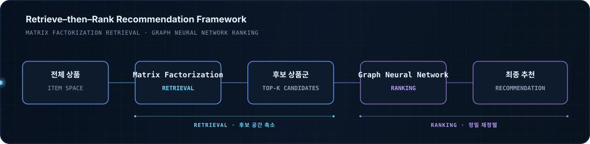

  

  <a href="https://github.com/Nekerworld">GitHub</a> ·
  <a href="https://velog.io/@nekerworld/posts">Velog</a> ·
  <a href="mailto:chrisabc94@gmail.com">Email</a>

---

## ◇ 소개

전자공학을 기반으로 **Embedded System, Robotics, Computer Vision, AI**를 공부하고 개발해 왔습니다.

회로와 MCU에서 시작해 센서 데이터를 처리하고, 시스템을 제어하며, AI를 통해 데이터를 해석하고, 최종적으로 사용자가 사용할 수 있는 Software와 Service까지 연결하는 과정에 관심이 있습니다.

대표적으로 **UWB · Vision · STM32 기반 자율 환자 추종 시스템**, **Matrix Factorization · GNN 기반 추천 시스템**, **LLM 기반 자동 코드 리뷰 플랫폼** 등을 개발하고 연구했습니다.

| 구분        | 상세                                                                     |
| --------- | ---------------------------------------------------------------------- |
| **학력**    | 한국공학대학교 전자공학(주전공) · 인공지능융합(부전공)                                        |
| **교육**    | 삼성청년SW·AI아카데미 (SSAFY)                                                  |
| **관심 분야** | Intelligent Embedded Systems · Robotics · Computer Vision · Applied AI |
| **연구 분야** | Recommender Systems · Graph Neural Networks                            |

## ◇ 주요 성과

<table>
<tr>
<td width="50%" align="center">
<h3>4회 수상</h3>
AI · Embedded · Robotics 
프로젝트 및 경진대회
</td>
<td width="50%" align="center">
<h3>제1저자</h3>
Matrix Factorization + GNN 
추천 시스템 연구
</td>
</tr>
<tr>
<td width="50%" align="center">
<h3>자율 환자 추종 시스템</h3>
UWB · Vision · STM32 
Autonomous Smart IV Pole
</td>
<td width="50%" align="center">
<h3>LLM 코드 리뷰</h3>
GitHub Pull Request 기반 
Refactory
</td>
</tr>
</table>

---

# ◇ 주요 프로젝트

## 01. [환자 추종 스마트 링거폴대](https://github.com/Wake-Up-It-s-a-Hospital)

`Embedded` `Robotics` `Computer Vision` `Control` `Sensor Fusion`

> **UWB와 비전 센서를 활용해 환자를 인식하고 자율 추종하는 Mapless 의료 보조 시스템**

### 시스템 구성

  

**문제 정의** 
환자가 이동할 때 링거폴대를 직접 끌어야 하는 불편을 줄이고, 별도의 지도 구축 없이 복잡한 실내 환경에서도 환자를 안정적으로 추종하는 것을 목표로 했습니다.

**구현** 
UWB를 이용해 환자와의 거리를 측정하고, 양측 비전 센서를 통해 환자의 방향을 추정했습니다.  거리와 방향 정보를 결합해 이동 경로의 곡률을 계산하고, 이를 기반으로 속도와 조향을 제어하는 자율 추종 시스템을 구현했습니다.
 
초음파 센서를 이용한 장애물 감지와 여러 센서 정보를 결합해 실제 주행 환경에서 발생할 수 있는 오인식과 충돌 위험도 함께 고려했습니다.

**담당 및 기여** 

* YOLO 기반 환자 자동 인식
* 곡률 기반 자율 추종 알고리즘 설계
* STM32 기반 이동 및 모터 제어
* UWB · Vision · Ultrasonic Sensor Fusion
* 추종 및 안전 주행 로직 구현
* Embedded System과 상위 시스템 통합
* QC · 통합 테스트 · 실제 주행 테스트

**기술 스택** 
`STM32` `ESP32` `UWB` `Computer Vision` `YOLO` `Embedded C` `Sensor Fusion` `AWS`

**성과** 
한국공학대학교 전자공학부 **학부장상**

---

## 02. [Hybrid Retrieve–then–Rank Recommendation System](https://github.com/Nekerworld/PBDA_Teamproject)

`AI` `Recommendation System` `GNN` `Research`

> **Matrix Factorization의 검색 효율성과 Graph Neural Network의 표현력을 결합한 대규모 추천 프레임워크**

### 시스템 구성

  

**문제 정의** 
대규모 추천 시스템에서 모든 사용자와 상품의 조합을 복잡한 딥러닝 모델로 직접 평가하면 데이터 규모가 증가할수록 높은 계산 비용이 발생합니다.

**접근 방법** 
전체 상품을 대상으로 빠르게 후보를 검색하는 단계와 선택된 후보를 정교하게 평가하는 단계를 분리했습니다.  **Matrix Factorization**을 Retrieval 단계에 적용해 추천 후보를 생성하고, **Graph Neural Network**를 Ranking 단계에 적용해 후보 상품의 순위를 다시 계산하는 Retrieve–then–Rank 구조를 설계했습니다.
 
이를 통해 전통적인 추천 알고리즘과 Graph 기반 Deep Learning 모델을 하나의 추천 Pipeline으로 결합했습니다.

**담당 및 기여**

* Hybrid Retrieve–then–Rank Architecture 설계
* Matrix Factorization 기반 Candidate Retrieval 구현
* GNN 기반 Ranking Model 구성
* 대규모 E-commerce Interaction Data 전처리
* 모델 학습 및 실험 설계
* 추천 성능 비교 및 결과 분석
* 논문 작성 — **제1저자**

**기술 스택** 
`Python` `PyTorch` `Matrix Factorization` `Graph Neural Network` `Recommender Systems`

**연구** 
*A Hybrid Retrieve–then–Rank Framework Integrating Matrix Factorization and Graph Neural Networks*
IEEE Access · **제1저자** · Revision 대기 중

---

## 03. [Refactory](https://github.com/2024-Winter-BootCamp-TeamD)

`LLM` `Web` `Frontend` `UI/UX`

> **LLM을 활용해 GitHub Pull Request의 코드 리뷰를 자동화하는 개발자 협업 플랫폼**

### 시스템 구성

  

**문제 정의** 
팀 프로젝트에서는 Pull Request마다 반복적인 코드 리뷰가 필요하지만, 모든 변경 사항을 사람이 직접 확인하고 피드백하는 과정에는 상당한 시간과 노력이 필요합니다.

**해결 방법** 
GitHub Pull Request와 LLM을 연결해 코드 변경 사항을 분석하고, 자동으로 코드 리뷰 결과를 제공하는 웹 플랫폼을 개발했습니다.
 
사용자가 자동 리뷰 결과를 빠르게 파악하고 필요한 내용을 확인할 수 있도록 Pull Request와 코드 리뷰를 중심으로 화면 구조를 설계했습니다.

**담당 및 기여**

* Frontend Development
* UI / UX Design
* 코드 리뷰 결과를 효과적으로 전달하기 위한 Interface 설계
* Pull Request 중심의 사용자 흐름 설계
* 서비스 화면 및 Interaction 구현

**기술 스택** 
`React` `JavaScript` `LLM` `GitHub` `UI/UX`

**성과** 
Techeer Winter BootCamp **공동 3위**

---

# ◇ 연구

<table>
<tr>
<td>

### A Hybrid Retrieve–then–Rank Framework Integrating Matrix Factorization and Graph Neural Networks

**Matrix Factorization 기반 Retrieval × Graph Neural Network 기반 Ranking**

대규모 추천 시스템의 계산 비용 문제를 다루기 위해 **Matrix Factorization 기반 Retrieval과 Graph Neural Network 기반 Ranking**을 결합한 하이브리드 추천 구조를 연구했습니다.

전체 상품을 복잡한 모델로 평가하는 대신 Matrix Factorization을 이용해 후보군을 먼저 축소하고, 후보군에 대해서만 GNN 기반 Ranking을 수행하는 Retrieve–then–Rank 구조를 적용했습니다.

</td>
</tr>
</table>

  

| 항목        | 내용                                                                                               |
| --------- | ------------------------------------------------------------------------------------------------ |
| **역할**    | **제1저자**                                                                                         |
| **논문명**   | A Hybrid Retrieve–then–Rank Framework Integrating Matrix Factorization and Graph Neural Networks |
| **저널**    | IEEE Access                                                                                      |
| **출판사**   | IEEE                                                                                             |
| **연구 분야** | Recommender Systems · Graph Neural Networks                                                      |
| **상태**    | Revision 진행 중                                                                                    |

---

# ◇ 수상

|   연도 | 수상        | 프로젝트 / 대회                                     |
| ---: | --------- | --------------------------------------------- |
| 2025 | **학부장상**  | 환자 추종 스마트 링거폴대 · 한국공학대학교 전자공학부                |
| 2024 | **최우수상**  | 수경재배식 스마트팜 · 제8회 임베디드 시스템 경진대회                |
| 2024 | **은상**    | Waveshare JetRacer · 제2회 미래형 자동차 자율주행 경진대회    |
| 2024 | **공동 3위** | Refactory · Techeer Winter BootCamp           |
| 2024 | **장려상**   | EV3 Robot Programming · 제5회 총장배 로봇 프로그래밍 경진대회 |

---

# ◇ 기술 스택

| 분야                         | 기반 기술                     | 활용 기술                                                               |
| -------------------------- | ------------------------- | ------------------------------------------------------------------- |
| **Embedded · Control**     | `C` `C++`                 | `STM32` `ESP32` `PlatformIO` `Motor Control` `Sensor Fusion`        |
| **AI · Computer Vision**   | `Python`                  | `PyTorch` `TensorFlow` `Keras` `YOLO` `GNN` `Recommendation System` |
| **Electronic Engineering** | `Verilog`                 | `Quartus` `PSpice` `Digital Logic` `Circuit Design`                 |
| **Software · Web**         | `JavaScript` `TypeScript` | `React` `Vue` `Vite` `Django` `MySQL` `Firebase`                    |

**Embedded · Control**
MCU 기반 센서 데이터 처리와 모터 제어, 여러 센서를 결합한 이동 시스템을 구현한 경험이 있습니다.

**AI · Computer Vision**
Computer Vision과 Recommendation System을 중심으로 Deep Learning 모델의 학습, 실험 및 시스템 적용 경험이 있습니다.

**Electronic Engineering**
전자공학 전공 과정에서 회로, 디지털 논리, FPGA 및 MCU 기반 시스템을 학습했습니다.

**Software · Web**
AI와 Embedded System에서 생성되는 결과를 실제 사용자가 이용할 수 있는 서비스와 인터페이스로 연결하기 위한 Software Development 경험이 있습니다.

---

# ◇ 학력 및 교육

## 한국공학대학교

**전자공학(주전공) · 인공지능융합(부전공)**

전자공학을 전공하며 회로, 디지털 논리, MCU, Embedded System과 제어를 학습했습니다.
이후 인공지능 분야를 함께 공부하며 Machine Learning, Deep Learning, Natural Language Processing, Computer Vision, Recommendation System으로 학습 영역을 확장했습니다.

### 삼성청년SW·AI아카데미 (SSAFY)

Software Engineering과 Algorithm Problem Solving을 학습하고, 프로젝트를 통해 소프트웨어 설계와 개발 역량을 확장하고 있습니다.

---

# ◇ 자격증

| 자격증                 | 발급 기관      |      취득 |
| ------------------- | ---------- | ------: |
| 데이터분석 준전문가 **ADsP** | 한국데이터산업진흥원 | 2026.06 |

---

### 연락처

<a href="https://github.com/Nekerworld"><b>GitHub</b></a>
  ·   <a href="https://velog.io/@nekerworld/posts"><b>Velog</b></a>
  ·   <a href="mailto:chrisabc94@gmail.com"><b>Email</b></a>

 

회로에서 지능까지, 하드웨어에서 AI까지 하나의 시스템으로 연결합니다.

  

`SENSING` ─ `EMBEDDED` ─ `CONTROL` ─ `INTELLIGENCE` ─ `PRODUCT`

